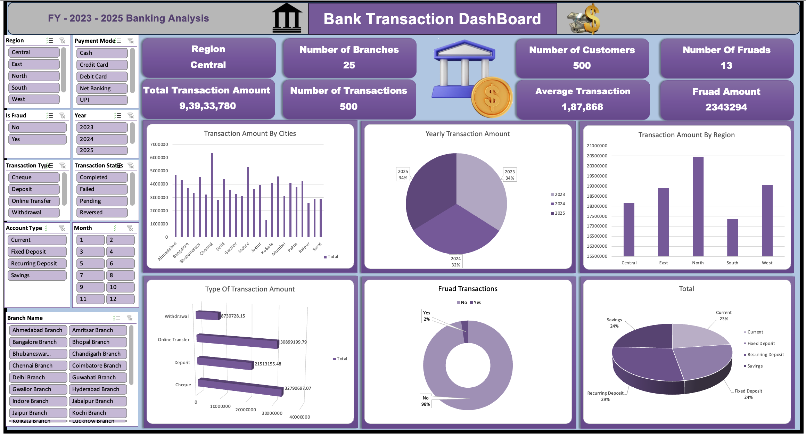
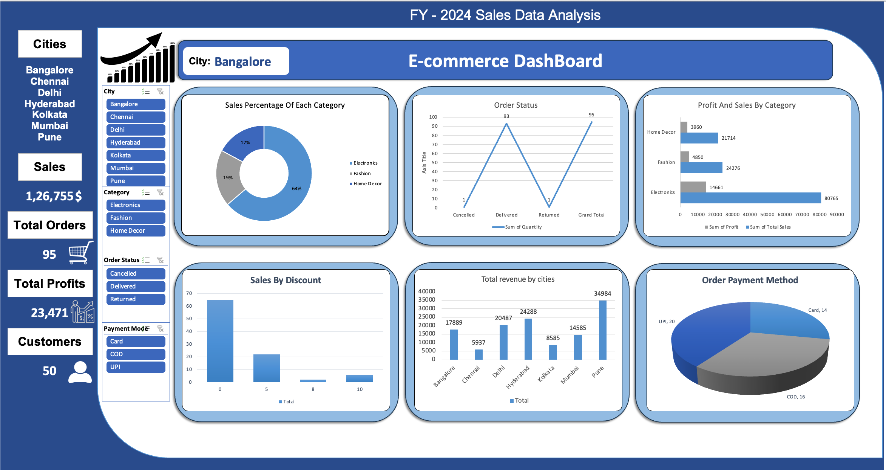

# 📊 Excel Data Analysis & Interactive Dashboards (Banking & Sales)

## 🔍 Project Overview
This project demonstrates **end-to-end data analysis using Microsoft Excel**, covering data cleaning, pivot table analysis, and interactive dashboard creation.  
The objective is to convert **raw business data into actionable insights** that support **data-driven decision-making** for banking and sales performance evaluation.

---

## 🎯 Business Objectives
- Analyze banking and sales data to identify **performance trends**
- Track **key performance indicators (KPIs)** at a glance
- Enable **interactive analysis** for multiple business scenarios
- Support **management-level reporting** using Excel dashboards

---

## 🧰 Tools & Skills Demonstrated
- Microsoft Excel (Advanced)
- Pivot Tables & Pivot Charts
- Data Cleaning & Preparation
- KPI Calculation
- Interactive Dashboards using Slicers
- Business & Performance Analysis
- Data Visualization & Storytelling

---

## 📁 Datasets Used
| Dataset | Description |
|------|------------|
| Indian Banking Dataset | Customer, transaction, and banking performance data |
| Sales Performance Dataset | Product-wise, region-wise, and time-based sales data |

---

## 📈 Analysis & Methodology
- Data cleaning (missing values, formatting, standardization)
- KPI identification and calculation
- Pivot-based aggregation and segmentation
- Trend analysis and comparative performance analysis
- Interactive filtering using slicers for dynamic insights

---

## 📊 Dashboard Previews

### 🏦 Banking Performance Dashboard

**Key Insights Covered:**
- Customer and transaction performance overview
- Product-wise and region-wise analysis
- Identification of high and low-performing segments
- Quick KPI monitoring for decision-makers

---

### 🛒 Sales Performance Dashboard

**Key Insights Covered:**
- Sales trends over time
- Category and product-level performance
- Regional sales contribution analysis
- Performance comparison using dynamic filters

---

## 📂 Project Structure
Excel-Data-Analysis-Dashboard/
│
├── data/ # Raw datasets
├── dashboards/ # Excel dashboards & pivot analysis
├── visuals/ # Dashboard screenshots
├── videos/ # Dashboard walkthrough videos
└── README.md
---

## ▶️ Dashboard Walkthrough Videos
- Banking Dashboard Walkthrough → `videos/BankingDataDashBoard.mp4`
- Sales Dashboard Walkthrough → `videos/SalesDataDashBoard.mp4`

*These videos demonstrate real-time dashboard interactivity and slicer-based analysis.*

---

## 🚀 How to Use This Project
1. Download the Excel dashboard files from the `dashboards/` folder  
2. Enable editing and macros (if prompted)  
3. Use slicers to filter data by category, region, or time period  
4. Analyze KPIs and trends dynamically  

---

## 💡 Key Business Value
- Reduces manual reporting time using automated pivot dashboards
- Enables faster and clearer management-level insights
- Supports exploratory and ad-hoc analysis without coding
- Demonstrates real-world Excel skills required for analyst roles

---

## 🎓 Learning Outcomes
- Building professional Excel dashboards
- Translating data into meaningful business insights
- Designing clean and user-friendly analytical reports
- Applying analytical thinking to real business datasets

---

## 👤 About the Author
**Bhavani Chary**  
MBA (Marketing Analytics) | Aspiring Data Analyst  

**Skills:** Excel, SQL, Power BI, Python, Data Visualization  

📌 *This project is part of my data analytics portfolio.*

---

## 🔖 Keywords
`Excel Dashboard` `Data Analysis` `Pivot Tables` `Business Analytics`  
`MIS Reporting` `Banking Analytics` `Sales Analytics`
